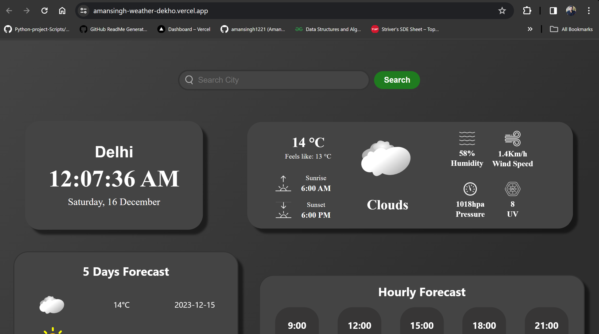

<br/>
<p align="center">
  <a href="https://github.com/lavish1612/weather_dekho">
    
  </a>

  <h3 align="center">Weather Dekho</h3>

  <p align="center">
    Explore, Plan, and Stay Informed with Weather Dekho – Your Trusted Weather Companion!
    <br/>
    <br/>
    <a href="https://github.com/lavish1612/weather_dekho"><strong>Explore the docs »</strong></a>
    <br/>
    <br/>
    <a href="https://github.com/lavish1612/weather_dekho">View Demo</a>
    .
    <a href="https://github.com/lavish1612/weather_dekho/issues">Report Bug</a>
    .
    <a href="https://github.com/lavish1612/weather_dekho/issues">Request Feature</a>
  </p>
</p>

      

## Table Of Contents

* [About the Project](#about-the-project)
* [Built With](#built-with)
* [Getting Started](#getting-started)
  * [Prerequisites](#prerequisites)
  * [Installation](#installation)
* [Contributing](#contributing)
* [License](#license)
* [Authors](#authors)
* [Acknowledgements](#acknowledgements)

## About The Project



Weather Dekho is a comprehensive web application designed to provide users with accurate and real-time weather information. Whether you're planning your day, a trip, or just curious about the current weather conditions, Weather Dekho has got you covered. The app combines a user-friendly interface with powerful weather data to deliver a seamless and insightful experience.

Key Features:

Real-Time Weather Updates:
Stay informed with up-to-the-minute weather updates for your location. The app ensures that you have the latest information to plan your activities accordingly.

Location-Based Services:
Seamlessly access weather details for your current location, or explore the forecast for different cities. The app leverages location-based services to provide personalized weather insights tailored to your needs.

Multi-Day Forecasts:
Plan ahead with multi-day forecasts that enable users to anticipate changes in weather conditions over an extended period. Whether you're preparing for a weekend getaway or a week-long trip, Weather Dekho has you prepared.

User-Friendly Design:
The app boasts a clean and user-friendly design, ensuring that users of all levels can easily navigate and access the information they need. The interface prioritizes clarity and simplicity for an enhanced user experience.

Responsive Design:
Access Weather Dekho on various devices, thanks to its responsive design. Whether you're using a desktop, tablet, or mobile phone, the app adapts to different screen sizes, ensuring a consistent and enjoyable experience.

## Built With

Here are a few examples.Weather Dekho is your go-to weather app, crafted with React for a smooth experience. We used CSS to make it look great and OpenWeather API to give you the most accurate updates. Adding a touch of fun, we incorporated animated icons to show you the weather conditions in a lively way. This app is all about simplicity and reliability. It's like having your weather buddy, providing real-time data so you can plan your day with confidence. Enjoy the seamless blend of technology and meteorology with Weather Dekho – making weather updates simple, engaging, and accurate!

## Getting Started

This is an example of how you may give instructions on setting up your project locally.
To get a local copy up and running follow these simple example steps.

### Prerequisites

This is an example of how to list things you need to use the software and how to install them.

* npm

```sh
npm install npm@latest -g
```

### Installation

1. Get a free API Key at [https://openweathermap.org/](https://openweathermap.org/)

2. Clone the repo

```sh
git clone https://github.com/lavish1612/weather_dekho.git
```

3. Install NPM packages

```sh
npm install
```

4. Enter your API_KEY in `Weatherdashboard.js`

```JS
const apiKey = 'ENTER YOUR API';
```

## Contributing

We welcome contributors to join us in enhancing Weather Dekho and making it even more valuable for users worldwide. Whether you're a seasoned developer or just getting started, there are various ways to contribute:

Help us improve features or fix bugs by submitting pull requests.
Contribute new functionalities to make Weather Dekho even better.
Report any issues or bugs you encounter while using the app.
Provide detailed information to help us identify and resolve problems promptly.
Suggest new features or improvements you'd like to see in Weather Dekho.
Share your ideas to enhance user experience and functionality.


### Creating A Pull Request

1. Fork the Project
2. Create your Feature Branch (`git checkout -b feature/AmazingFeature`)
3. Commit your Changes (`git commit -m 'Add some AmazingFeature'`)
4. Push to the Branch (`git push origin feature/AmazingFeature`)
5. Open a Pull Request

## License

Distributed under the MIT License. See [LICENSE](https://github.com/lavish1612/weather_dekho/blob/main/LICENSE.md) for more information.

## Authors

* **Aman Singh** - *Computer Science Student* - [Aman Singh](https://github.com/lavish1612) - *Developed Weather-Dekho*

